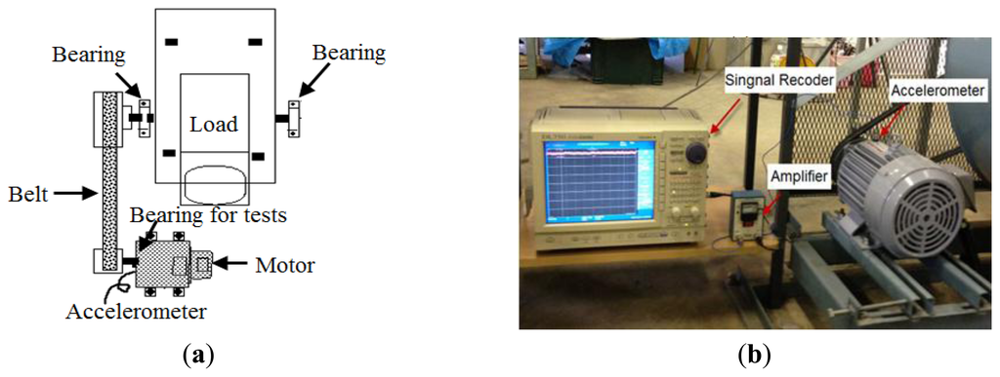
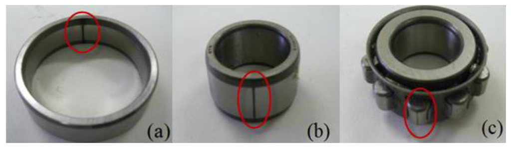

# 轴承转动数据集故障预测

## 环境准备

```bash
git clone https://github.com/HCl-lab/Kangnam-University-bearing-prediction.git
cd Kangnam-University-bearing-prediction
conda create -n bearing python=3.8
conda activate bearing
pip install -r requirements.txt
```

## 数据集

数据集参数:

| 采样频率 | 转速 | 位置   | 状态 |
| -------- | ---- | ------ | ---- |
| 50kHz    | 600  | 内圈   | N    |
| 50kHz    | 800  | 外圈   | N    |
| 50kHz    | 1000 | 滚动体 | N    |

路径:
```
- data
  - ib600_2.csv
  - ib800_2.csv
  - ib1000_2.csv
  - n600_3_2.csv
  - n800_3_2.csv
  - n1000_3_2.csv
  - ob600_2.csv
  - ob800_2.csv
  - ob1000_2.csv
  - tb600_2.csv
  - tb800_2.csv
  - tb1000_2.csv
```


## 模型训练

```bash
python main.py
```

## 引用
> Li K, Ping X, Wang H, et al. Sequential fuzzy diagnosis method for motor roller bearing in variable operating conditions based on vibration analysis[J]. Sensors, 2013, 13(6): 8013-8041.
>
> https://zhuanlan.zhihu.com/p/641503381
> 
> https://link.zhihu.com/?target=https%3A//pan.baidu.com/s/1zB4TUovv7U4k-DZfuokQPQ
